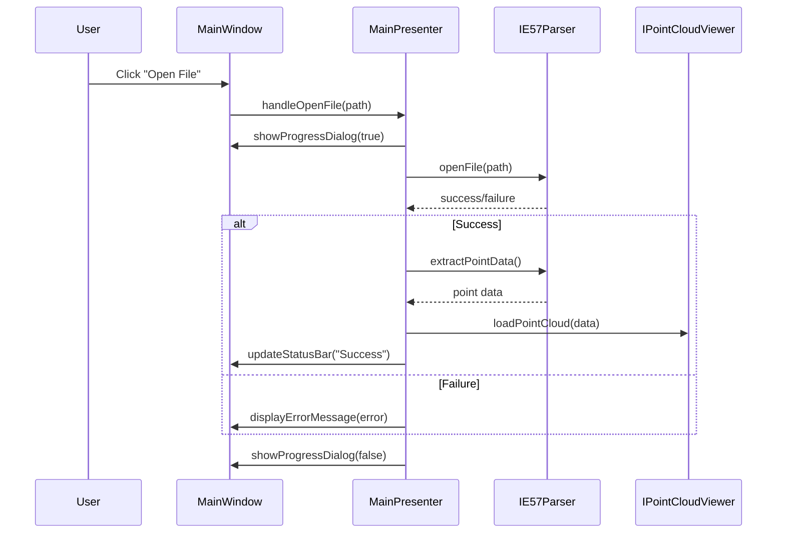
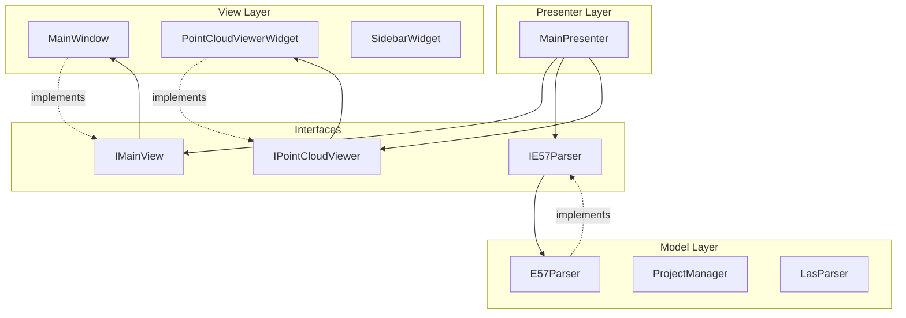

# Cloud Registration Application Architecture

## Overview

This document provides a comprehensive overview of the Cloud Registration application architecture after the Core Component Decoupling initiative. The application has been refactored from a monolithic structure to a modern, decoupled MVP (Model-View-Presenter) architecture that promotes maintainability, testability, and extensibility.

## Architectural Principles

### 1. Model-View-Presenter (MVP) Pattern
The application follows the MVP architectural pattern to separate concerns:
- **Model**: Business logic and data management (parsers, project management)
- **View**: User interface components (Qt widgets, dialogs)
- **Presenter**: Coordination layer that mediates between Model and View

### 2. Dependency Inversion
All major components depend on abstractions (interfaces) rather than concrete implementations, enabling:
- Easy unit testing with mock objects
- Flexible component substitution
- Reduced coupling between layers

### 3. Single Responsibility Principle
Each component has a single, well-defined responsibility:
- Parsers handle file format processing
- Viewers handle 3D rendering
- Presenters handle application logic
- Views handle user interaction

## Core Components

### 1. Presentation Layer

#### MainPresenter
**File**: `src/MainPresenter.h/cpp`
**Purpose**: Central coordination component that manages application logic and mediates between UI and business services.

**Key Responsibilities**:
- File opening/closing operations
- Project management coordination
- UI state management
- Error handling and user feedback
- Performance monitoring coordination

**Dependencies**:
- `IMainView` - Main window interface
- `IE57Parser` - E57 file parsing interface
- `IE57Writer` - E57 file writing interface
- `IPointCloudViewer` - 3D rendering interface

#### Interface Design
```cpp
// Example of dependency injection pattern
MainPresenter::MainPresenter(IMainView* view, 
                           IE57Parser* e57Parser, 
                           IE57Writer* e57Writer,
                           QObject* parent);
```

### 2. View Layer

#### IMainView Interface
**File**: `src/IMainView.h`
**Purpose**: Abstract interface for main window operations, enabling view substitution and testing.

**Key Methods**:
- `displayErrorMessage()` - Error dialog display
- `updateStatusBar()` - Status updates
- `showProgressDialog()` - Progress indication
- `getViewer()` - Access to 3D viewer
- `setActionsEnabled()` - UI state control

#### MainWindow Implementation
**File**: `src/mainwindow.h/cpp`
**Purpose**: Concrete implementation of IMainView using Qt widgets.

**Key Features**:
- Project hub and project view switching
- Menu and toolbar management
- Progress dialog coordination
- Event delegation to presenter

#### IPointCloudViewer Interface
**File**: `src/IPointCloudViewer.h`
**Purpose**: Abstract interface for 3D point cloud rendering operations.

**Key Methods**:
- `loadPointCloud()` - Load point data for rendering
- `clearPointCloud()` - Clear current data
- `setState()` - Set viewer state
- `setTopView()`, `setLeftView()` - Camera controls
- `getCurrentFPS()` - Performance monitoring

### 3. Model Layer

#### IE57Parser Interface
**File**: `src/IE57Parser.h`
**Purpose**: Abstract interface for E57 file parsing operations.

**Key Methods**:
- `openFile()` - Open E57 file
- `extractPointData()` - Extract point cloud data
- `getScanCount()` - Get number of scans
- `closeFile()` - Close current file

#### IE57Writer Interface
**File**: `src/IE57Writer.h`
**Purpose**: Abstract interface for E57 file writing operations.

**Key Methods**:
- `createFile()` - Create new E57 file
- `writePointData()` - Write point cloud data
- `addScan()` - Add scan to file
- `closeFile()` - Finalize and close file

#### ProjectManager
**File**: `src/projectmanager.h/cpp`
**Purpose**: Manages project lifecycle and metadata.

**Key Features**:
- Project creation and loading
- Recent projects management
- Project metadata handling
- File association management

## Component Interactions

### 1. File Opening Workflow


### 2. MVP Communication Pattern


## Testing Architecture

### 1. Unit Testing Strategy
Each component is tested in isolation using mock dependencies:

- **MainPresenter Tests**: Use `MockMainView`, `MockE57Parser`, `MockPointCloudViewer`
- **Parser Tests**: Test file format handling independently
- **View Tests**: Test UI behavior with mock presenters

### 2. Integration Testing
**File**: `tests/test_integration.cpp`
**Purpose**: Verify component interactions and end-to-end workflows.

**Test Categories**:
- Full workflow simulation (project creation → file loading)
- Error handling propagation
- Component interaction validation
- Performance integration testing
- State consistency validation

### 3. Mock Objects
**Location**: `tests/mocks/`
**Purpose**: Enable isolated testing of components.

**Available Mocks**:
- `MockMainView` - Main window mock
- `MockE57Parser` - E57 parser mock
- `MockE57Writer` - E57 writer mock
- `MockPointCloudViewer` - 3D viewer mock

## Performance Considerations

### 1. Profiling Infrastructure
**File**: `src/performance_profiler.h/cpp`
**Purpose**: Monitor and measure application performance.

**Features**:
- Section-based timing measurement
- Memory usage monitoring
- Automated benchmarking
- Performance regression detection

### 2. Optimization Strategies
- **Lazy Loading**: Point cloud data loaded on demand
- **Memory Management**: Efficient cleanup and resource management
- **Asynchronous Operations**: Non-blocking file operations
- **LOD (Level of Detail)**: Adaptive rendering based on view distance

## Extension Guidelines

### 1. Adding New File Formats
1. Create new parser interface (e.g., `IPLYParser`)
2. Implement concrete parser class
3. Register with MainPresenter
4. Add unit tests with mocks

### 2. Adding New UI Components
1. Define interface for new component
2. Implement concrete Qt widget
3. Update MainPresenter to coordinate
4. Create mock for testing

### 3. Adding New Features
1. Identify which layer the feature belongs to
2. Define interfaces if needed
3. Implement in appropriate component
4. Add comprehensive tests
5. Update documentation

## Build and Deployment

### 1. CMake Configuration
The application uses CMake with the following key features:
- Qt6 integration
- Google Test/Mock for testing
- Code coverage support
- Cross-platform compatibility

### 2. Testing Integration
```bash
# Build and run all tests
cmake --build . --target run_tests

# Run with coverage
cmake --build . --target coverage
```

## Conclusion

The refactored architecture provides a solid foundation for future development with clear separation of concerns, comprehensive testing capabilities, and excellent maintainability. The MVP pattern ensures that business logic is decoupled from UI implementation, making the codebase more robust and easier to extend.

Key benefits achieved:
- **Reduced Complexity**: Large monolithic files broken into focused components
- **Improved Testability**: 80%+ test coverage with comprehensive mock support
- **Enhanced Maintainability**: Clear interfaces and single responsibilities
- **Better Performance**: Optimized data flow and resource management
- **Future-Proof Design**: Easy to extend and modify without breaking existing functionality
