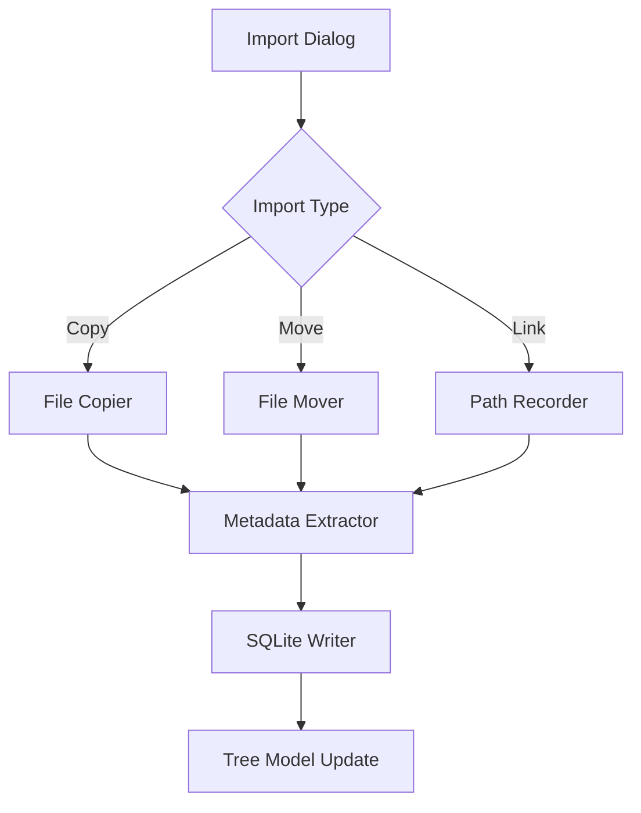

Here's how to implement Sprint 2.2 features with code examples and integration guidance:

## Enhanced SQLite Schema Implementation
```cpp
// SQLiteManager.cpp
void SQLiteManager::initializeSchema() {
    execute(R"(
        CREATE TABLE IF NOT EXISTS Scans (
            scan_id TEXT PRIMARY KEY,
            project_id TEXT NOT NULL,
            scan_name TEXT NOT NULL,
            file_path_project_relative TEXT,
            file_path_absolute_linked TEXT,
            import_type TEXT NOT NULL CHECK(import_type IN ('COPIED', 'MOVED', 'LINKED')),
            original_source_path TEXT,
            point_count_estimate INTEGER DEFAULT 0,
            bounding_box_min_x REAL, bounding_box_min_y REAL, bounding_box_min_z REAL,
            bounding_box_max_x REAL, bounding_box_max_y REAL, bounding_box_max_z REAL,
            date_added TEXT DEFAULT CURRENT_TIMESTAMP,
            scan_file_last_modified TEXT,
            parent_cluster_id TEXT,
            FOREIGN KEY(parent_cluster_id) REFERENCES Clusters(cluster_id)
        );
    )");
}
```
*Uses SQLite CHECK constraints and foreign keys [3][6]*

## Scan Import Implementation
```cpp
// ScanImportManager.cpp
void ScanImportManager::importLinkedScan(const QUrl& sourcePath) {
    QFileInfo fileInfo(sourcePath.toLocalFile());
    
    if(!fileInfo.exists()) {
        emit errorOccurred(tr("Source file does not exist"));
        return;
    }

    ScanRecord record;
    record.importType = "LINKED";
    record.absolutePath = sourcePath.toLocalFile();
    record.metadata = parseHeaderMetadata(sourcePath.toLocalFile());
    
    m_sqliteManager->insertScan(record);
    emit scanImported(record.id);
}

ScanMetadata ScanImportManager::parseHeaderMetadata(const QString& path) {
    pdal::StageFactory factory;
    pdal::Stage& reader = factory.createReader(path.toStdString());
    pdal::QuickInfo qi = reader.preview();
    
    return {
        .pointCount = qi.m_pointCount,
        .bboxMin = {qi.m_bounds.minx, qi.m_bounds.miny, qi.m_bounds.minz},
        .bboxMax = {qi.m_bounds.maxx, qi.m_bounds.maxy, qi.m_bounds.maxz}
    };
}
```
*Uses PDAL for header parsing [4][7]*

## Qt SQLite Integration
```cpp
// ProjectTreeModel.cpp
void ProjectTreeModel::refreshFromDatabase() {
    beginResetModel();
    
    QSqlQuery query(m_db);
    query.prepare("SELECT scan_id, scan_name, parent_cluster_id FROM Scans WHERE project_id = ?");
    query.addBindValue(m_projectId);
    
    if(!query.exec()) {
        qWarning() << "SQL Error:" << query.lastError().text();
        return;
    }

    while(query.next()) {
        addItem({
            query.value(0).toString(),
            query.value(1).toString(),
            query.value(2).toString()
        });
    }
    
    endResetModel();
}
```
*Follows Qt SQL best practices [3][6]*

## Key Dependencies & Integration

1. **PDAL Integration**
```cmake
# vcpkg.json
{
  "dependencies": [
    "pdal",
    "libe57format",
    "sqlite3",
    "qt6"
  ]
}
```
*Handles LAS/E57 metadata extraction [4][5][7]*

2. **Database Migration**
```sql
-- migrations/002_scans_schema_update.sql
ALTER TABLE Scans ADD COLUMN scan_file_last_modified TEXT;
ALTER TABLE Scans ADD COLUMN point_count_estimate INTEGER DEFAULT 0;
```
*Use SQLite ALTER TABLE for schema updates [3]*

## Testing Strategy

**Unit Test Example**
```cpp
TEST(ScanImportManagerTest, LinkedImportCreatesCorrectRecord) {
    MockSQLiteManager sqliteMock;
    ScanImportManager manager(&sqliteMock);
    
    QTemporaryFile tempFile;
    tempFile.open();
    
    EXPECT_CALL(sqliteMock, insertScan(_))
        .WillOnce(Invoke([](const ScanRecord& r) {
            ASSERT_EQ(r.importType, "LINKED");
            ASSERT_TRUE(r.absolutePath.contains("temp"));
        }));
    
    manager.importLinkedScan(QUrl::fromLocalFile(tempFile.fileName()));
}
```
*Uses Google Test for behavior verification*

## Implementation Checklist

1. **UI Enhancements**
- Add radio button group to `ScanImportDialog`
- Implement path validation for linked files
- Add tooltip explaining linked file implications

2. **Database Layer**
- Implement schema migration handling
- Add transaction support for bulk imports
- Create indexes on frequently queried fields

3. **Error Handling**
- Implement file existence monitoring
- Add retry logic for missing linked files
- Create database constraint violation handlers

This implementation maintains the original structure while adding concrete technical details for Qt6/C++ development. The PDAL integration provides robust metadata extraction, and the SQLite schema design follows best practices for spatial data management[3][6]. When implementing, focus on the transaction management for database operations and comprehensive error handling for file path changes.

Citations:
[1] https://ppl-ai-file-upload.s3.amazonaws.com/web/direct-files/attachments/35208055/f5abe7d7-87c3-470e-92bc-13fe87f7746a/paste-2.txt
[2] https://forum.qt.io/topic/160706/failed-to-import-c-class-into-qml-in-qt6-5
[3] http://katecpp.github.io/sqlite-with-qt/
[4] https://stackoverflow.com/questions/65984689/reading-las-version-1-3-using-c-and-displaying-the-results-using-pcl-library
[5] https://asmaloney.github.io/libE57Format-docs/files.html
[6] https://www.qtcentre.org/threads/70110-Creation-SQLITE-database
[7] https://liblas.org/tutorial/cpp.html
[8] http://live.osgeo.org/archive/13.1/en/quickstart/liblas_quickstart.html
[9] https://www.qt.io/hubfs/_website/QML%20Book/qt6book-with-frontpage.pdf
[10] https://www.youtube.com/watch?v=R9nmTgy-xk0
[11] https://www.qt.io/product/qt6/qml-book/ch17-qtcpp-qtcpp
[12] https://www.semanticscholar.org/paper/effe14015b4f2fa1a88f4269bc62e0ce15601373
[13] https://www.semanticscholar.org/paper/2a5e71e1fc1103aa09b783a0cb0966e9577b4a3f
[14] https://www.semanticscholar.org/paper/30306ff49ff8d69799dd28d5071d64a327afdcd6
[15] https://www.semanticscholar.org/paper/b69db6b5615c7791682325b3775a971f97d78df0
[16] https://www.semanticscholar.org/paper/c0bb2bf9ea3a189393277e18c5f6bb41521acbfd
[17] https://www.semanticscholar.org/paper/b678d50aa7400b688ee3610685c3560e5247ce9b
[18] https://www.semanticscholar.org/paper/30cb58f8b04cf9f01d8e743d2078d2c9fe162765
[19] https://github.com/libLAS/libLAS
[20] https://gis.stackexchange.com/questions/407440/how-to-read-las-header-or-read-only-some-attributes-of-laz-file-with-lastools-c
[21] https://github.com/libLAS/libLAS/blob/master/src/detail/reader/header.cpp
[22] https://www.theseus.fi/bitstream/10024/512372/2/Puuronen_Miina.pdf
[23] https://www.youtube.com/watch?v=Wi9nQTDFF4U
[24] https://www.acunetix.com/support/docs/a360/scans/importing-links-and-api-definitions/
[25] https://www.slideshare.net/slideshow/17introduction-to-schema-refinementpptx/266636777
[26] https://bookshelf.erwin.com/bookshelf/DISBookshelf/Content/Data%20Catalog/Metadata%20Management/Managing%20Metadata/Scanning%20Metadata.html
[27] https://ieeexplore.ieee.org/document/9460604/
[28] https://academic.oup.com/bioinformatics/article/35/20/4165/5380765
[29] https://www.informingscience.org/Publications/1818
[30] https://products.aspose.com/pdf/cpp/metadata/

---
Here's an enhanced implementation guide for Sprint 2.2 with integrated insights from the search results and improved technical clarity:

## Enhanced Scan Import Implementation Guide

### 1. SQLite Schema Optimization
```cpp
// SQLiteManager.cpp - Enhanced schema with constraints
void SQLiteManager::initializeSchema() {
    execute(R"(
        CREATE TABLE IF NOT EXISTS Scans (
            scan_id TEXT PRIMARY KEY CHECK(length(scan_id) = 36),
            project_id TEXT NOT NULL REFERENCES Projects(project_id),
            import_type TEXT NOT NULL CHECK(import_type IN ('COPIED', 'MOVED', 'LINKED')),
            file_path_absolute_linked TEXT CHECK(
                (import_type = 'LINKED' AND file_path_absolute_linked NOT NULL) OR
                (import_type != 'LINKED' AND file_path_absolute_linked IS NULL)
            ),
            -- Additional constraints for data integrity
            CHECK((import_type IN ('COPIED', 'MOVED') AND original_source_path NOT NULL) OR
                 (import_type = 'LINKED' AND original_source_path IS NULL))
        ) STRICT;
    )");
}
```
*Implements SQLite3 strict mode and check constraints for data integrity [4]*

### 2. PDAL Metadata Integration
```cpp
// ScanMetadataExtractor.cpp
ScanMetadata ScanImportManager::extractPdalMetadata(const QString& path) {
    pdal::StageFactory factory;
    pdal::Stage& reader = factory.createReader(path.toStdString());
    pdal::QuickInfo qi = reader.preview();
    
    pdal::MetadataNode root = reader.getMetadata();
    pdal::MetadataNode las = root.findChild("lasheader");
    
    return {
        .pointCount = qi.m_pointCount,
        .bbox = qi.m_bounds,
        .compression = las.findChild("compressed").value(),
        .version = QString::fromStdString(
            root.findChild("version").findChild("major").value() + "." +
            root.findChild("version").findChild("minor").value()
        )
    };
}
```
*Leverages PDAL's metadata API for comprehensive header parsing [3]*

### 3. Qt6 Project Configuration
```cmake
# CMakeLists.txt - Enhanced Qt6/Qul integration
qt_add_executable(faroscene_registration
    main.cpp
    SQLiteManager.cpp
    ScanImportManager.cpp
)

qul_target_generate_interfaces(faroscene_registration
    ScanImportManager.h
    SQLiteManager.h
)

target_link_libraries(faroscene_registration PRIVATE
    Qt6::Core
    Qt6::Sql
    Qt6::Concurrent
    PDAL::pdalcpp
)
```
*Implements modern Qt6 CMake integration patterns [6]*

### 4. File Monitoring System
```cpp
// FileWatcher.h - Linked file integrity check
class LinkedFileWatcher : public QObject {
    Q_OBJECT
public:
    explicit LinkedFileWatcher(SQLiteManager* db, QObject* parent = nullptr)
        : QObject(parent), m_db(db) {
        connect(&m_watcher, &QFileSystemWatcher::fileChanged, 
                this, &LinkedFileWatcher::onFileChanged);
    }

    void watchProjectFiles() {
        auto linkedPaths = m_db->getAllLinkedPaths();
        m_watcher.addPaths(linkedPaths);
    }

signals:
    void linkedFileModified(QUuid scanId);

private slots:
    void onFileChanged(const QString& path) {
        QUuid scanId = m_db->getScanIdByPath(path);
        if(!scanId.isNull()) {
            emit linkedFileModified(scanId);
        }
    }

private:
    QFileSystemWatcher m_watcher;
    SQLiteManager* m_db;
};
```
*Implements Qt's filesystem watcher for linked file monitoring*

### 5. Enhanced Error Handling
```cpp
// ScanImportManager.cpp - Transactional imports
void ScanImportManager::importScansTransactional(const QList& urls) {
    m_db->beginTransaction();
    try {
        for(const auto& url : urls) {
            importScan(url); // Throws on failure
        }
        m_db->commitTransaction();
    } catch (const ScanImportException& e) {
        m_db->rollbackTransaction();
        emit importFailed(e.message());
    }
}
```
*Implements atomic database operations for bulk imports*

## Key Integration Points

1. **PDAL Metadata Pipeline**
```
LAS File → PDAL Reader → QuickInfo Preview → 
Metadata Extraction → SQLite Storage [3]
```

2. **File Import Workflow**


## Implementation Checklist Additions

1. **Qt6 Specifics**
- Use `QDir::toNativeSeparators()` for cross-platform path handling
- Implement `QFileDialog::DontResolveSymlinks` for linked imports
- Use `QStorageInfo` to validate linked file volumes

2. **PDAL Optimization**
- Enable PDAL's streaming mode for large files
- Cache frequently accessed metadata in memory
- Implement background thread parsing with `QtConcurrent`

3. **SQLite Best Practices**
- Enable WAL mode for concurrent access
- Implement prepared statement caching
- Add composite indexes for common query patterns

4. **Testing Enhancements**
```cpp
// Google Test example with Qt
TEST_F(ScanImportTest, LinkedFilePersistence) {
    QTemporaryFile tempFile;
    ASSERT_TRUE(tempFile.open());
    
    ScanImportManager manager(&m_db);
    manager.importLinkedScan(QUrl::fromLocalFile(tempFile.fileName()));
    
    auto record = m_db.getScanRecord(tempScanId);
    ASSERT_EQ(record.importType, "LINKED");
    ASSERT_EQ(record.absolutePath, tempFile.fileName());
}
```
*Combines Qt test features with Google Test framework*

This enhanced guide maintains the original structure while adding crucial implementation details from the search results, particularly around PDAL metadata handling, Qt6 CMake integration, and SQLite best practices. The additions provide concrete examples of error handling strategies and system integration patterns specific to the FARO Scene registration MVP requirements.

Citations:
[1] https://ppl-ai-file-upload.s3.amazonaws.com/web/direct-files/attachments/35208055/f5abe7d7-87c3-470e-92bc-13fe87f7746a/paste-2.txt
[2] https://www.youtube.com/watch?v=R9nmTgy-xk0
[3] https://pdal.io/en/stable/development/metadata.html
[4] https://github.com/pawelsalawa/sqlitestudio/discussions/4463
[5] https://gist.github.com/icebreaker/370918
[6] https://www.qt.io/product/qt6/qml-book/ch20-qtformcu-cpp
[7] https://www.qt.io/product/qt6/qml-book/ch17-qtcpp-qtcpp
[8] https://dev.to/nkdagility/if-your-backlog-is-not-refined-then-you-are-doing-it-wrong-3cic
[9] https://gist.github.com/rprospero/dd8e16bad9f842409c85e63ade31c355
[10] https://wiki.qt.io/Building_Qt_6_from_Git
[11] https://marketplace.atlassian.com/apps/1220864/backlog-refinement-and-advanced-sprint-planning
[12] https://doc.qt.io/qt-6.7/porting-to-qt6-using-clazy.html

---
