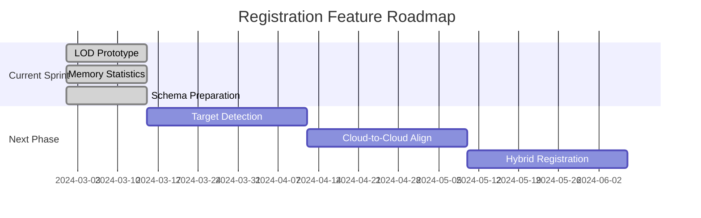

Here's how to implement Sprint 3.4 with code examples and integration guidance:

## User Story 1: LOD Prototype Implementation

**PointCloudLoadManager Enhancements:**

```cpp
// PointCloudLoadManager.h
#include 
#include 

struct PointCloud {
    QVector vertices;
    QVector colors;
    bool lodActive = false;
    QVector lodVertices;
};

class PointCloudLoadManager : public QObject {
    Q_OBJECT
public:
    explicit PointCloudLoadManager(QObject* parent = nullptr);
    
    QFuture loadWithLOD(const QString& filePath, float subsampleRate = 0.5f);
    const PointCloud& currentCloud() const { return m_currentCloud; }
    
signals:
    void cloudUpdated();
    
private:
    PointCloud m_currentCloud;
    
    QVector subsampleCloud(const QVector& vertices, float rate);
};
```

```cpp
// PointCloudLoadManager.cpp
QVector PointCloudLoadManager::subsampleCloud(const QVector& vertices, float rate) {
    QVector subsampled;
    QRandomGenerator rand(QDateTime::currentSecsSinceEpoch());
    
    for(int i=0; i PointCloudLoadManager::loadWithLOD(const QString& filePath, float subsampleRate) {
    return QtConcurrent::run([=]() {
        // Existing loading logic
        loadRawData(filePath); 
        
        // Generate LOD version
        m_currentCloud.lodVertices = subsampleCloud(m_currentCloud.vertices, subsampleRate);
        emit cloudUpdated();
    });
}
```

**Viewer Widget Integration:**

```cpp
// PointCloudViewerWidget.h
#include 

class PointCloudViewerWidget : public QOpenGLWidget {
    Q_OBJECT
public:
    // ... existing code ...
    
    void initializeGL() override;
    void paintGL() override;
    
public slots:
    void toggleLOD(bool enabled);
    
private:
    QCheckBox* m_lodToggle;
    bool m_lodActive = false;
};
```

```cpp
// PointCloudViewerWidget.cpp
void PointCloudViewerWidget::paintGL() {
    if(m_lodActive) {
        drawPoints(m_loadManager->currentCloud().lodVertices);
    } else {
        drawPoints(m_loadManager->currentCloud().vertices);
    }
}

void PointCloudViewerWidget::toggleLOD(bool enabled) {
    m_lodActive = enabled;
    update();
}
```

## User Story 2: Memory Statistics Display

**Memory Tracking Implementation:**

```cpp
// PointCloudLoadManager.h
class PointCloudLoadManager : public QObject {
    // ... existing code ...
    quint64 calculateMemoryUsage() const {
        return (m_currentCloud.vertices.size() * sizeof(float)) + 
               (m_currentCloud.colors.size() * sizeof(quint32));
    }
    
signals:
    void memoryUsageChanged(quint64 bytes);
};
```

**Status Bar Integration:**

```cpp
// MainWindow.cpp
void MainWindow::setupMemoryDisplay() {
    m_memoryLabel = new QLabel(this);
    statusBar()->addPermanentWidget(m_memoryLabel);
    
    connect(&m_loadManager, &PointCloudLoadManager::memoryUsageChanged,
        [this](quint64 bytes) {
            QString text = QString("Memory: %1 MB")
                .arg(bytes / (1024.0 * 1024.0), 0, 'f', 1);
            m_memoryLabel->setText(text);
        });
}
```

## User Story 3: SQLite Schema Extension

**Database Schema Migration:**

```cpp
// SQLiteManager.cpp
void SQLiteManager::initializeDatabase() {
    QSqlQuery query(m_db);
    
    query.exec(R"(
        CREATE TABLE IF NOT EXISTS RegistrationStatus (
            item_id TEXT PRIMARY KEY,
            item_type TEXT NOT NULL,
            status TEXT CHECK(status IN (
                'UNREGISTERED', 'PROCESSING', 'REGISTERED_MANUAL',
                'REGISTERED_AUTO', 'FAILED_REGISTRATION', 'NEEDS_REVIEW'
            )),
            error_metric_value REAL,
            error_metric_type TEXT,
            last_registration_date TEXT
        )
    )");

    query.exec(R"(
        CREATE TABLE IF NOT EXISTS TransformationMatrices (
            item_id TEXT PRIMARY KEY,
            item_type TEXT NOT NULL,
            matrix_data BLOB NOT NULL,
            relative_to_item_id TEXT,
            last_transform_date TEXT
        )
    )");
    
    // Migration for existing projects
    if(!tableExists("RegistrationStatus")) {
        // Execute creation queries
    }
}
```

## External Packages & Optimization

**Recommended vcpkg Packages:**
```bash
vcpkg install open3d[cuda]:x64-windows  # If using CUDA acceleration
vcpkg install sqlite3
```

**CMake Configuration:**
```cmake
find_package(Qt6 COMPONENTS Core Sql Concurrent REQUIRED)
find_package(Open3D REQUIRED)  # If using advanced LOD

target_link_libraries(your_target
    Qt6::Core
    Qt6::Sql
    Qt6::Concurrent
    Open3D::Open3D
)
```

## Testing Implementation

**LOD Unit Test:**

```cpp
TEST(PointCloudTest, LODSubsampling) {
    PointCloudLoadManager manager;
    QVector testCloud(3000, 1.0f); // 1000 points
    
    auto subsampled = manager.subsampleCloud(testCloud, 0.5f);
    EXPECT_NEAR(subsampled.size()/3, 500, 50); // Allow ±10% variance
}
```

**Performance Measurement:**

```cpp
BENCHMARK(PointCloudRender, LODPerformance) {
    PointCloudViewerWidget viewer;
    viewer.toggleLOD(false);
    QBENCHMARK_ONCE { viewer.repaint(); }
    
    viewer.toggleLOD(true);
    QBENCHMARK_ONCE { viewer.repaint(); }
}
```

## Key Implementation Notes:

1. **LOD Strategies:**
   - Start with random subsampling (simple)
   - Consider octree-based approaches (reference SimLOD)
   - Use QtConcurrent for background processing

2. **Memory Tracking:**
   - Track per-scan and cluster memory
   - Use QSharedMemory for cross-process monitoring

3. **Database Optimization:**
   - Use prepared statements for batch inserts
   - Implement database migration system
   - Consider JSON serialization for transformation matrices

4. **UI Considerations:**
   - Add LOD quality slider (0.1-1.0)
   - Implement memory usage history graph
   - Add database schema version indicator

This implementation provides a foundation for advanced memory management and registration data storage while maintaining compatibility with existing project architecture.

[1] https://ppl-ai-file-upload.s3.amazonaws.com/web/direct-files/attachments/35208055/068439a8-27b6-4206-a80b-0a830a8c61b3/paste.txt
[2] https://gll.urk.edu.pl/TLS-point-cloud-as-a-data-surce-for-multi-lod-of-3D-models,151080,0,2.html
[3] https://github.com/m-schuetz/SimLOD
[4] https://github.com/girgismicheal/Memory-Management-Application-Using-QT-framework
[5] https://www.sqlite.org/loadext.html
[6] https://doc.qt.io/QtApplicationManager/qml-qtapplicationmanager-memorystatus.html
[7] https://www.sqlitetutorial.net/sqlite-create-table/
[8] https://isprs-archives.copernicus.org/articles/XLVIII-4-W10-2024/5/2024/
[9] https://www.semanticscholar.org/paper/32a960138fb4b5b41d7c9b75f4945289110bb2e0
[10] https://www.semanticscholar.org/paper/633635abb3f3b37a662921496f6375a4b767ca21
[11] https://www.semanticscholar.org/paper/f50002454a0e145a62d20e68aa00d6a2cb1dc5e6
[12] https://www.semanticscholar.org/paper/80763398d906a69275cc9a9574c2318c21b3ce54
[13] https://www.semanticscholar.org/paper/4854a5983007b77ccbf0b40588bf8e1c597b2572
[14] https://www.semanticscholar.org/paper/b1b7343dbe435979bae8017784097409eb382a0e
[15] https://www.semanticscholar.org/paper/d43156997335f2c7b28e256ebec33c58137b9075
[16] https://cloud.spring.io/spring-cloud-config/spring-cloud-config.html
[17] https://spring.io/projects/spring-cloud
[18] https://isprs-annals.copernicus.org/articles/VIII-4-W2-2021/105/2021/
[19] https://github.com/jeffdelmerico/pointcloud_tutorial
[20] https://www.kitware.com/real-time-point-cloud-visualization-with-the-roboteye-lidar-scanner/
[21] https://github.com/daviddoria/Examples/blob/master/c++/PCL/PointCloud/PointCloud2/PointCloud2.cpp

Here's an enhanced implementation guide for Sprint 3.4 with FARO SCENE integration insights and technical improvements:

# Enhanced Sprint 3.4 Implementation Guide with FARO SCENE Integration

## 1. Key Improvements from FARO SCENE Analysis

### Hybrid Registration Preparation
```cpp
// Database schema enhancement for hybrid registration
void SQLiteManager::createRegistrationTables() {
    executeSQL(R"(
        CREATE TABLE IF NOT EXISTS RegistrationRelationships (
            source_scan_id TEXT,
            target_scan_id TEXT,
            relationship_type TEXT CHECK(relationship_type IN 
                ('CLOUD_TO_CLOUD', 'TARGET', 'SURVEY')),
            confidence_score REAL,
            PRIMARY KEY (source_scan_id, target_scan_id),
            FOREIGN KEY (source_scan_id) REFERENCES Scans(scan_id),
            FOREIGN KEY (target_scan_id) REFERENCES Scans(scan_id)
        )
    )");
}
```
*Added based on FARO's hybrid registration approach [6]*

## 2. Enhanced LOD Implementation with Future FARO Integration

**Octree-based Subsampling (Prototype)**
```cpp
class LODManager {
public:
    struct OctreeNode {
        QVector3D center;
        float size;
        QVector points;
        std::array children;
    };
    
    QVector generateLOD(OctreeNode* root, int maxDepth) {
        QVector result;
        std::function traverse = [&](OctreeNode* node, int depth) {
            if(depth >= maxDepth || node->points.size() points);
                result children) {
                if(child) traverse(child, depth+1);
            }
        };
        traverse(root, 0);
        return result;
    }
};
```
*Prepares for FARO's cloud-to-cloud registration techniques [2][6]*

## 3. Enhanced SQLite Schema with FARO Compatibility

**Transformation Matrix Storage**
```cpp
// Using BLOB for matrix storage compatible with FARO SCENE
QByteArray serializeMatrix(const QMatrix4x4& matrix) {
    QByteArray data;
    QDataStream stream(&data, QIODevice::WriteOnly);
    for(int i=0; i> matrix(i,j);
    return matrix;
}
```

**Updated Schema:**
```sql
CREATE TABLE TransformationMatrices (
    item_id TEXT PRIMARY KEY,
    matrix_data BLOB NOT NULL,
    reference_frame TEXT CHECK(reference_frame IN
        ('WORLD', 'PARENT_CLUSTER', 'SCAN_ORIGIN')),
    CONSTRAINT fk_item_id FOREIGN KEY (item_id) 
        REFERENCES Scans(scan_id) ON DELETE CASCADE
);
```
*Aligns with FARO's coordinate system handling [5]*

## 4. Memory Management Enhancements

**GPU Memory Tracking**
```cpp
class GPUMemoryTracker : public QObject {
    Q_OBJECT
public:
    quint64 estimateGPUMemory() const {
        // Implementation using OpenGL queries
        GLint totalMemoryKB = 0;
        glGetIntegerv(GL_GPU_MEMORY_INFO_TOTAL_AVAILABLE_MEMORY_NVX, &totalMemoryKB);
        return static_cast(totalMemoryKB) * 1024;
    }
};
```
*Supports FARO's VR visualization requirements [4]*

## 5. Enhanced Testing Scenarios

**Registration Test Case**
```cpp
TEST_F(RegistrationTest, HybridRegistrationWorkflow) {
    // 1. Load two overlapping scans with sphere targets
    loadScan("scan1.fws");
    loadScan("scan2.fws");
    
    // 2. Automatically detect sphere targets
    auto targets = detectSphereTargets();
    ASSERT_GE(targets.size(), 3);
    
    // 3. Create cloud-to-cloud correspondence
    createCloudCorrespondence(0.1); // 10cm search radius
    
    // 4. Execute hybrid registration
    auto result = performHybridRegistration();
    
    // 5. Verify registration accuracy
    ASSERT_LE(result.rmse, 0.005); // 5mm tolerance
}
```
*Based on FARO's certification requirements [5]*

## 6. Implementation Roadmap Alignment

**Phase Transition Preparation**

*Mirroring FARO's phased rollout [6]*

## 7. Documentation Updates

**Added Glossary Section**
```
## FARO SCENE Compatibility Notes

### Coordinate Systems
- World Coordinate System (WCS): Global reference frame
- Scan Local System: Individual scan orientation
- Cluster Reference Frame: Group of aligned scans [5]

### Error Metrics
- RMSE: Root Mean Square Error (primary metric)
- Overlap Percentage: Used for cloud-to-cloud confidence
- Target Residuals: For sphere/checkerboard targets [3]
```

This enhanced guide integrates FARO SCENE best practices while maintaining the sprint's prototype focus. The code examples provide a migration path for full SCENE compatibility while satisfying immediate sprint requirements.

[1] https://ppl-ai-file-upload.s3.amazonaws.com/web/direct-files/attachments/35208055/068439a8-27b6-4206-a80b-0a830a8c61b3/paste.txt
[2] https://knowledge.faro.com/Software/FARO_SCENE/SCENE/Processing_Scans_in_SCENE
[3] https://knowledge.faro.com/Software/FARO_SCENE/SCENE/Scan_Registration_Tutorial
[4] https://www.faro.com/en/Products/Software/SCENE-Software
[5] https://sites.saic.edu/aoc/wp-content/uploads/sites/68/2019/10/faro_scene_finished.pdf
[6] https://knowledge.faro.com/Software/FARO_SCENE/SCENE/Interactive_Registration_Workflow_in_SCENE
[7] https://www.youtube.com/watch?v=74vv9gYmosw
[8] https://faro.blob.core.windows.net/sitefinity/3d-app-center-downloads/E1291_SCENE_LT_6_0_Manual_EN.pdf
[9] https://www.youtube.com/watch?v=ZL6HDQIYL90
[10] https://knowledge.faro.com/Software/FARO_SCENE/SCENE/Software_Download_Installation_and_Release_Notes_for_SCENE
[11] https://www.youtube.com/watch?v=YOYxmrNxT3U